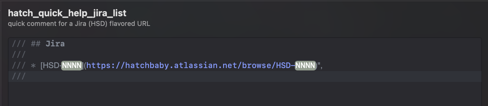
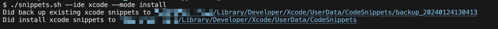

# About 
This repo is used to share "team" code snippets (ignores personal snippets). Includes a script which acts as:
* Installer w/local backup
* Publish changes back to the repo.
* Enforces naming conventions between the snippet and filename.
* Supports `Xcode`, some support for `VSCode` as well. 

## The Problem
Writing expressive comments. 

Xcode can help you write comments if you press <kbd>cmd</kbd>+<kbd>opt</kbd>+<kbd>/</kbd>


## We can do better. 

Xcode supports a lot more syntax & markup than the IDE leads you to believe.

* [Xcode Callouts](https://developer.apple.com/library/archive/documentation/Xcode/Reference/xcode_markup_formatting_ref/Attention.html#//apple_ref/doc/uid/TP40016497-CH29-SW1)
* Most Markdown is supported

Here are some examples

| Callouts | Markdown |
|---|---|
|  |  |


# Examples

Below are a few examples / categories.

| URL | Code |
|---|---|
|  |  |
|  |  |


## These are great for TODO lists
| FIXME | TODO |
|---|---|
|  |  |
|  |  |


| Callouts | Markdown |
|---|---|
|  |  |


# How to Use

## Clone this repo

```sh
git clone git@github.com:hatch-mobile/CodeSnippets.git
cd CodeSnippets
```

## Usage 

### TLDR
If you just want to install the Xcode snippets on your dev machine:
```
# list snippets
./snippets.sh --ide xcode --mode list

# install snippets (after copying existing to backup folder)
./snippets.sh --ide xcode --mode install

# install snippets (after moving existing to backup folder)
./snippets.sh --ide xcode --mode install-clean

# Any of the above can accept the `--debug` flag for additional output
```

### Help
For an understanding of what this tool can do, invoke the `--help` page:


## Assets

Example: List snippets that are available to install. 

The installer tool will only install/backup snippet files that have the prefix `hatch_` while the others are considered to be personal snippets (applies to Xcode only for now).


--- 

Example: Installing snippets for Xcode




# References
* [Writing Expressive Code Comments](https://hatchbaby.atlassian.net/wiki/spaces/iosDevelopers/pages/679444483/Writing+Expressive+Xcode+Comments)
* [Experimenting with Xcode Markup and Markdown](https://hatchbaby.atlassian.net/wiki/spaces/iosDevelopers/pages/647364623/Experimenting+with+Xcode+Comment+Markup+Markdown+support)
* [Callouts (Apple Docs)](https://developer.apple.com/library/archive/documentation/Xcode/Reference/xcode_markup_formatting_ref/Attention.html#//apple_ref/doc/uid/TP40016497-CH29-SW1)
* [Formatting your Documentation (Apple DocC)](https://www.swift.org/documentation/docc/formatting-your-documentation-content#Link-to-Symbols-and-Other-Content)


## TODO
* [X] establish and document naming convention for snippets (title/filename should match)
  * [ ] update help/readme
  * [x] update existing filenames/snippets
* [ ] establish and document convention for hotkey
  * [ ] update help/readme
  * [ ] update existing snippets
