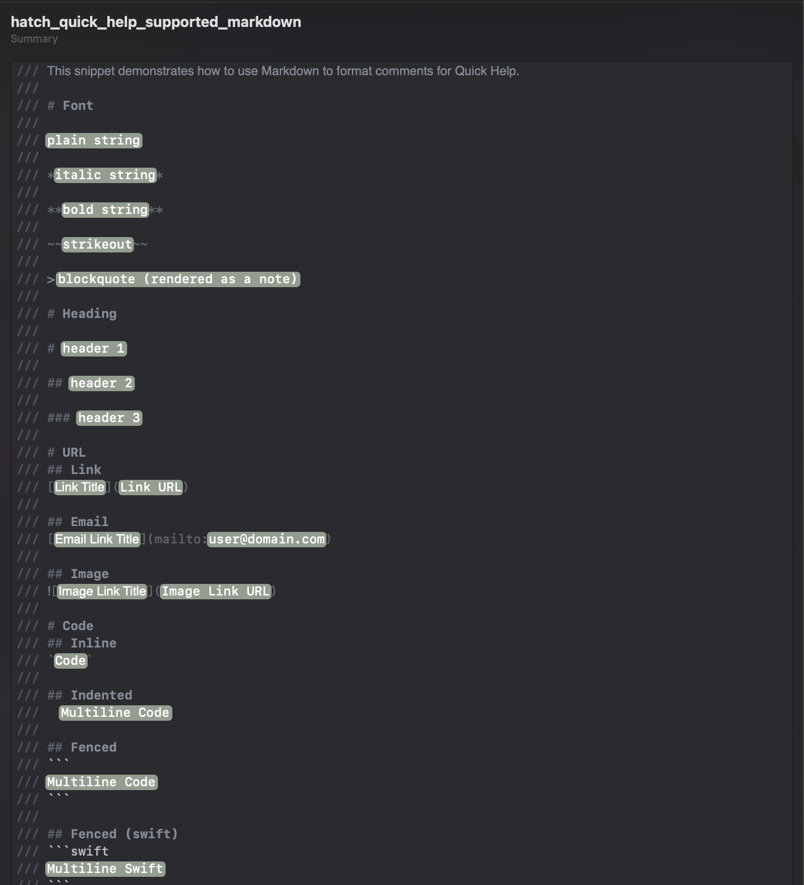

# About 
This repo is used to share "team" code snippets (ignores personal snippets). Includes a script which acts as:
* Installer w/local backup
* Publish changes back to the repo.
* Enforces naming conventions between the snippet and filename.
* Supports `Xcode`, some support for `VSCode` as well. 

# Examples

Below are a few examples / categories.

| URL | Code |
|---|---|
|  |  |
|  |  |


## These are great for TODO lists
| FIXME | TODO |
|---|---|
|  |  |
|  |  |


| Callouts | Markdown |
|---|---|
|  |  |


# How to Use

## Clone this repo

```sh
git clone git@github.com:hatch-mobile/CodeSnippets.git
cd CodeSnippets
```

## Usage 

### TLDR
If you just want to install the Xcode snippets on your dev machine:
```
# list snippets
./snippets.sh --ide xcode --mode list

# install snippets (after copying existing to backup folder)
./snippets.sh --ide xcode --mode install

# install snippets (after moving existing to backup folder)
./snippets.sh --ide xcode --mode install-clean

# Any of the above can accept the `--debug` flag for additional output
```

### Help
For an understanding of what this tool can do, invoke the `--help` page:

<!--  -->


## Assets

Example: List snippets that are available to install. 

The installer tool will only install/backup snippet files that have the prefix `hatch_` while the others are considered to be personal snippets (applies to Xcode only for now).

<!--  -->


--- 

Example: Installing snippets for Xcode

<!--  -->


## TODO
* [X] establish and document naming convention for snippets (title/filename should match)
  * [ ] update help/readme
  * [x] update existing filenames/snippets
* [ ] establish and document convention for hotkey
  * [ ] update help/readme
  * [ ] update existing snippets
